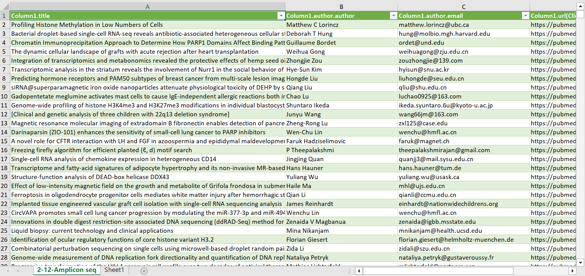

scrapy project 

> An open source and collaborative framework for extracting the data you need from websites.In a fast, simple, yet extensible way.

Target website: `https://pubmed.ncbi.nlm.nih.gov/`

data example:

